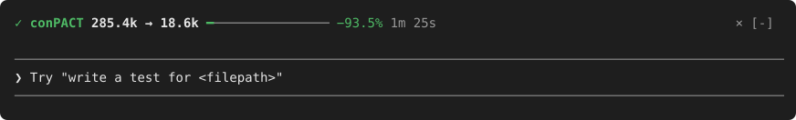
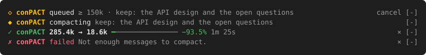
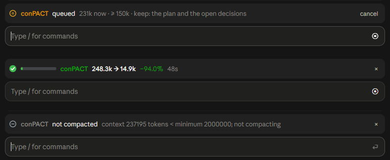
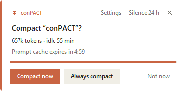
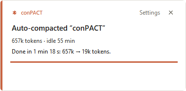
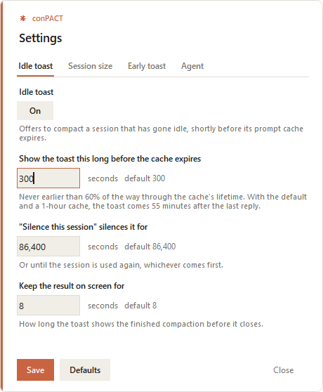

# conPACT

*CONtext comPACT.* Lets your coding agent compact its own context when a piece of
work is done, and offers to compact idle sessions before their prompt cache
expires. For **Claude Code Desktop** and **ChatGPT Desktop (Codex)**.

## Why

Long agent sessions get expensive in two ways:

- **The context keeps growing** long after the work that needed it is finished.
- **An idle session goes cold.** Come back after its prompt cache has expired and
  the next message re-reads the whole context uncached.

`/compact` fixes both, but only if someone types it at the right moment.
conPACT does it for you, for real:

- **At the end of a piece of work**, the agent queues a compaction of its own
  session. It runs after the final answer, as a genuine `/compact`: your chat
  history stays visible, and only the live context is summarised. With the
  conPACT mod, Claude Code does it from inside the session; without it, it
  travels over Remote Control.
- **When a big session sits idle**, a small toast appears shortly before the
  cache expires and offers to compact it now, or always to do so for that
  session.
- **In ChatGPT Desktop**, the same two things, through an optional sidecar.

What it is not: a token-threshold trigger, a reminder for you to type `/compact`,
`/clear`, or a fake "I compacted" message.

## Requirements

- **Python 3.11 or later.** No other dependencies; everything is standard
  library.
- **Claude Code Desktop.** With the conPACT mod (Claude Code 2.1.284 or later) a
  session compacts itself, for the agent and for the idle toast, and needs
  nothing else. Without the mod, **Remote Control must be on** for the sessions
  you want compacted: it is the route the `/compact` travels.
- **Windows, Linux or macOS.** The whole test suite runs on Windows 11, Linux
  and macOS, and conPACT has been used live on Windows. Only the **Claude Code**
  integration reads a macOS Keychain login; ChatGPT Desktop and Codex CLI use
  Codex's own authenticated process and conPACT never reads their credentials. See
  [what each platform supports](docs/setup.md#what-each-platform-supports).

## Quick start (Claude Code)

**1. Get the code.** Nothing to build; the tools run straight from the checkout.

```bash
git clone https://github.com/st0nebridge/conPACT.git conpact
```

**2. Add the Stop hook.** This is what sends the `/compact` at the end of a turn.
In `~/.claude/settings.json`:

```json
{
  "hooks": {
    "Stop": [
      { "hooks": [ { "type": "command", "command": "/path/to/conpact/tools/stop_compact.sh", "timeout": 90 } ] }
    ]
  }
}
```

That is macOS and Linux. On Windows the command is
`C:/path/to/conpact/tools/stop_compact.cmd`. It works from the next turn end, in
every session, including ones already open.

**3. Register the MCP server,** so the agent can queue a compaction with a tool
call. Use the full path to the Python executable, not a wrapper script such as
pyenv-win's `python.bat`:

```bash
claude mcp add --scope user conpact -- "/path/to/python3" "/path/to/conpact/tools/mcp_server.py"
```

Sessions pick it up when they next start.

**4. Install the mod.** With it, a queued compaction is carried out inside the
session at the end of the turn, with no Remote Control:

```bash
claude plugin marketplace add st0nebridge/conPACT
claude plugin install conpact@conpact
```

It needs Claude Code 2.1.284 or later; before 2.1.287 mods are in early access
and need one environment variable. Where the mod does not load, the Stop hook
and the MCP server carry on without it. Details, and how to load it from your
checkout instead: [docs/claude-code-mod.md](docs/claude-code-mod.md).

**5. Turn on Remote Control** in each session's toolbar, or wait for the first
idle toast to offer to turn it on for every new session. Only a session the mod
is not loaded in needs it, for the idle toast and for a queued compaction.

**6. Check** what each open session still needs:

```bash
python tools/session_ready.py
```

More detail, including uninstalling: [docs/setup.md](docs/setup.md).

## Using it

### Let the agent do it

With the MCP server loaded, the agent gets four tools, and the server tells it
when to use them: after verified, saved implementation work, such as a feature,
fix or build, or when you explicitly ask to compact. Routine questions,
read-only investigations, status reports and intermediate answers do not queue
compaction, even when the context is large. It never queues in a throwaway
worktree session (one Claude Code
started in a `.claude/worktrees/...` checkout, which is merged and discarded
rather than resumed). You can also just ask it to compact.

| Tool | What it does |
|---|---|
| `queue_compaction` | Compact this session when the turn ends. Optional `focus` (what the summary should keep) and `min_context_tokens` (skip it if the context is smaller). |
| `cancel_compaction` | Withdraw it. |
| `compaction_status` | What is queued, and how big the context is now. |
| `hold_idle_toast` | Hold the early idle toast while waiting on a long build or test run. |

The tool only records the request, and the compaction happens when the turn
ends, so it always lands after the final answer, and at most once. With the mod
loaded, the mod answers the tools and compacts the session itself; without it,
the Stop hook sends `/compact` over Remote Control.

With the mod, one row above the prompt follows the request: queued (with what
it will keep and **cancel**), compacting, then what it came to, with a meter of
what was kept and a **×** to dismiss it. An idle-toast compaction shows there
too. In the Desktop app the mark at the start is drawn: a pulsing dot, a
turning ring, a check or a cross.

<p>
  
</p>
<p>
  
</p>

The same row in the Desktop app's Code tab:

<p>
  
</p>

More on the row: [docs/claude-code-mod.md](docs/claude-code-mod.md#the-band-above-the-prompt).

### Or from the shell

```bash
python tools/bridge_send.py --self --request                            # compact at the end of this turn
python tools/bridge_send.py --self --request --min-context-tokens 150k  # ...only if it is worth it
```

Every option: [docs/commands.md](docs/commands.md).

### The idle toast

It turns up by itself for sessions of 100,000 tokens or more, five minutes
before a 1-hour cache expires, in the bottom-right corner, without taking focus.

<p>
  <picture>
    <source media="(prefers-color-scheme: dark)" srcset="docs/images/toast-ask-dark.png">
    
  </picture>
  <picture>
    <source media="(prefers-color-scheme: dark)" srcset="docs/images/toast-done-dark.png">
    
  </picture>
</p>

- **Compact now**: compact it while the cache is still warm.
- **Always compact**: do this for that session from now on, without asking.
- **Silence 24 h** or **Not now**: leave it.

Using the session again cancels it, and nothing is ever sent to a busy session.
There is an optional earlier toast too: [docs/idle-toast.md](docs/idle-toast.md).

## ChatGPT Desktop

conPACT reads and measures ChatGPT Desktop's threads out of the box, without
changing anything. To compact the thread you are working in, which the app holds
open, install the sidecar with one click:

```bash
python tools/codex_sidecar.py window
```

then restart ChatGPT Desktop. The same MCP tools can be registered for Codex
threads. What the sidecar is, what it touches and how to remove it:
[docs/chatgpt-desktop.md](docs/chatgpt-desktop.md).

Check the installed Codex integration without changing anything:

```bash
python tools/doctor.py
```

It checks the Codex login, MCP registration, sidecar, bundled Codex build and
read-only thread access. A missing Claude Code Keychain login is informational,
not a Codex failure.

## Codex CLI

Install one Codex Stop hook, then start the terminal UI through conPACT:

```bash
conpact-codex --install
conpact-codex
```

If that command is not on `PATH`, run `uv tool install --editable .` followed
by `uv tool update-shell`, then open a new terminal.

On the first start, open `/hooks` and trust the conPACT hook. The launcher uses
Codex's `--remote` option to connect the terminal UI to conPACT's existing
token-protected loopback app-server. The token stays in an environment variable,
not the process arguments. All four MCP tools then work in the CLI, including
turn-end `queue_compaction` and the idle toast.

Plain `codex` remains unchanged; use `conpact-codex` for the integrated path.
Without an editable install, use `python tools/codex_cli.py`. See
[Codex CLI setup](docs/setup.md#codex-cli).

## Settings

```bash
python tools/settings.py                                # opens the settings window
python tools/settings.py show
python tools/settings.py set min_context_tokens 150k
```

Or click **Settings** on any toast. Every setting, its default and its range:
[docs/settings.md](docs/settings.md).

<p>
  <picture>
    <source media="(prefers-color-scheme: dark)" srcset="docs/images/settings-dark.png">
    
  </picture>
</p>

## Safety at a glance

- **It only acts on the session that asked.** No tool takes a target; the
  session is identified from the runtime, never from anything the model says.
- **It only sends `/compact`.** There is no free-text sending, and a request
  fires at most once.
- **The mod reaches only what it needs:** no process, no network, no file
  written. `claude plugin validate src/mod` lists every call it makes.
- **The idle toast sends only what you click,** or what you switched that one
  session to do automatically.
- **Your login token never leaks.** It is never printed, logged, or stored
  anywhere but its own file.
- **The ChatGPT Desktop sidecar is opt-in and reversible.** Its control port is
  loopback-only and token-guarded.

The full model: [docs/security.md](docs/security.md).

## Status

| | |
|---|---|
| **Tests** | Windows 2,825 passed (2026-10-08); Linux 2,003 passed (2026-09-25); macOS 2,178 passed (2026-09-23) |
| **Claude Code, live** | Agent-queued and toast-driven compactions observed end to end; with the mod, an agent-queued compaction observed end to end with Remote Control off, a Desktop session compacted through `/compact`, and the band drawn in the terminal and the Desktop app |
| **ChatGPT Desktop, live** | Sidecar compaction, turn-end arming, and a thread queueing its own compaction observed end to end |

What has been observed, what has not yet, and the mutation scores:
[docs/verification.md](docs/verification.md).

## Documentation

| | |
|---|---|
| [How it works](docs/how-it-works.md) | The goal, the Remote Control route, and why a request fires only after the final answer |
| [Setup](docs/setup.md) | Stop hook, MCP server, the mod, Remote Control, sessions that were already open |
| [The Claude Code mod](docs/claude-code-mod.md) | Compacting a session from inside Claude Code, without Remote Control |
| [Idle toast](docs/idle-toast.md) | Stages, buttons, auto-compaction, holds |
| [Settings](docs/settings.md) | Every setting, with defaults and ranges |
| [Commands](docs/commands.md) | Every command-line tool |
| [ChatGPT Desktop](docs/chatgpt-desktop.md) | Codex threads, the sidecar, and Codex Remote Control |
| [Security model](docs/security.md) | What conPACT can and cannot do, and why |
| [Architecture](docs/architecture.md) | Modules, entry points, state files, layout |
| [Verification](docs/verification.md) | Tests, coverage, mutation scores, live evidence |

## Contributing

The test suite needs `pytest`, `pytest-cov` for the mutation tester's own tests,
and `jsonschema` for the MCP tool schemas:
`pip install pytest pytest-cov jsonschema`, then `python -m pytest -q`.
Before changing how something works, read the two project records at the top of
the repository: [CHANGES.md](CHANGES.md) lists every change, newest first, with
how it was verified, and [DECISIONS.md](DECISIONS.md) lists every settled design
choice and the reason for it.

[Lance Sandino](https://github.com/LanceSandino) contributed the macOS support,
the Codex CLI compaction and the read-only doctor, the macOS sidecar's move to
ChatGPT Desktop's new layout, and the check that confirms a Codex compaction
with a very large history record.

## License

MIT. See [LICENSE](LICENSE).
